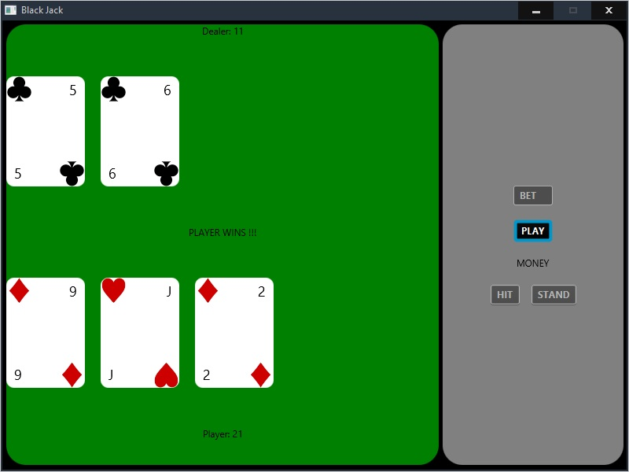

# Project Title

Java program where a user can play a simple version of the game Black Jack against a computer.

## Example Output

## Analysis Steps

Each player is delt 2 cards from a deck of 52 cards. After the initial 2 cards are delt the player is then given the option to "hit" themselves for additional cards. The computer will repeat that process after the user has completed theirs. The hand that is closest to 21 without going over wins the game. If both the player and computer have the same score from hand, the match will end in a draw.

### Design

Multiple classes.
- BlackJackApplication 
- Card 
- Deck 
- Hand.

### Testing

Stage Displays correctly
Clicking play deals 2 cards to player
Clicking play deals 2 cards to dealer @ the same time as player
Cards display suit - rank - value correctly
If game is won from first draw display the player that won
Clicking hit will deal 1 additional card to player
Clicking stand will signal dealer to deal additional cards until dealer reaches at least 17. (the dealer will not "hit" if above 17)

## Notes

n/a

## Do not change content below this line
## Adapted from a README Built With

* [Dropwizard](http://www.dropwizard.io/1.0.2/docs/) - The web framework used
* [Maven](https://maven.apache.org/) - Dependency Management
* [ROME](https://rometools.github.io/rome/) - Used to generate RSS Feeds

## Contributing

Please read [CONTRIBUTING.md](https://gist.github.com/PurpleBooth/b24679402957c63ec426) for details on our code of conduct, and the process for submitting pull requests to us.

## Versioning

We use [SemVer](http://semver.org/) for versioning. For the versions available, see the [tags on this repository](https://github.com/your/project/tags). 

## Authors

* **Billie Thompson** - *Initial work* - [PurpleBooth](https://github.com/PurpleBooth)

See also the list of [contributors](https://github.com/your/project/contributors) who participated in this project.

## License

This project is licensed under the MIT License - see the [LICENSE.md](LICENSE.md) file for details

## Acknowledgments

* Hat tip to anyone who's code was used
* Inspiration
* etc
